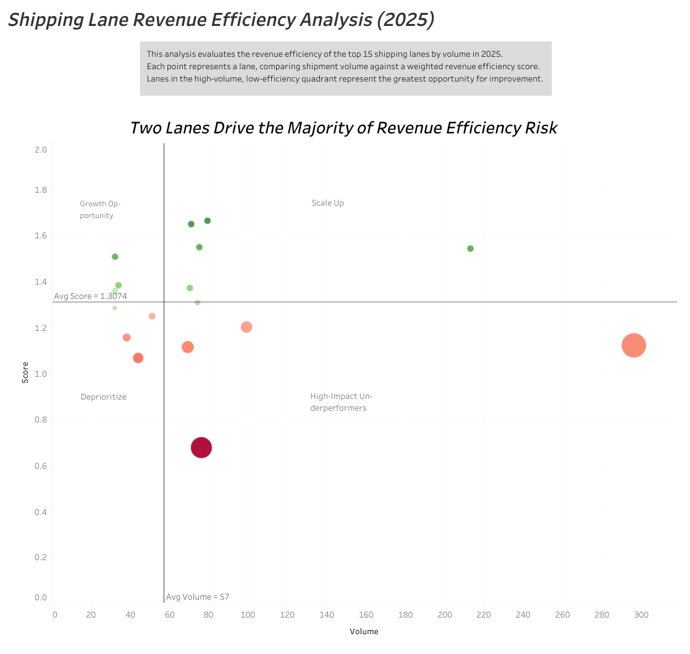
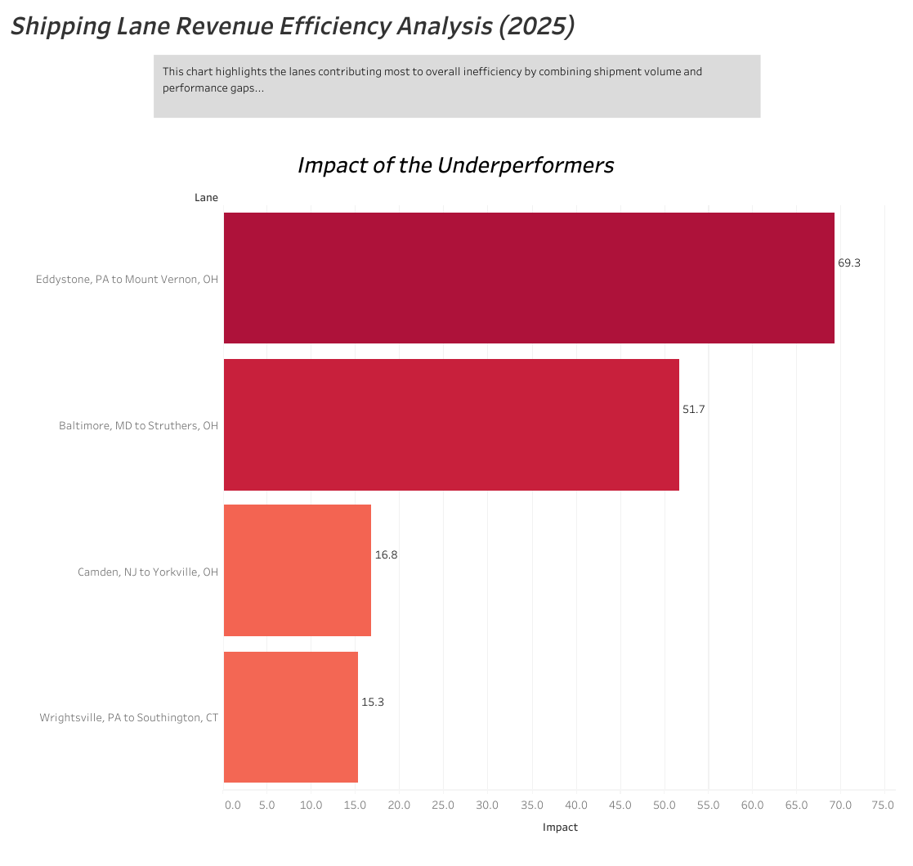
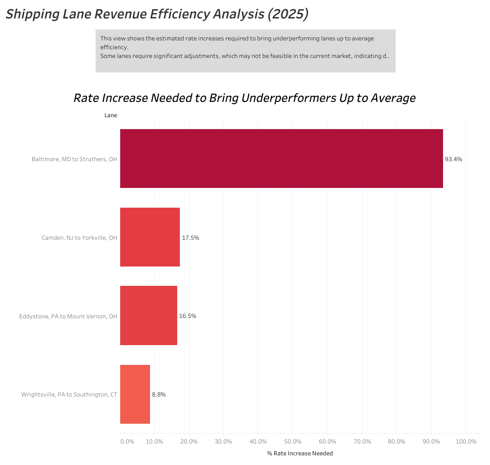

# Shipping Lanes Analysis
Freight lane revenue-efficiency analysis using SQL, Excel, and Tableau

A portfolio data analytics case study focused on identifying high-volume freight lanes with poor revenue efficiency.

## Overview
This project analyzes freight shipping lanes for a fictional logistics client, Allied Logistics, to determine which lanes are the least revenue-efficient and may require rate adjustments during annual bid planning.

The analysis focuses on the top 15 lanes by shipment volume in 2025 and evaluates efficiency using:
- Revenue per hour
- Revenue per mile
- Shipment volume

These metrics were combined into a weighted load score, emphasizing revenue per hour over revenue per mile.

## Key Findings
- 4 lanes were identified as **high-impact underperformers**
- These lanes had both **below-average load scores** and **above-average shipment volume**
- One lane, **Baltimore MD to Struthers OH**, was especially weak and would require an estimated **93.4% rate increase** to reach average performance
- Several lower-volume lanes also **underperformed**, but their overall business impact was smaller
- 10 lanes performed **above average**, with 6 showing strength in both efficiency and volume

## Business Problem
Allied Logistics needed to prepare its annual bid package for its largest customer. The goal was to identify which high-volume lanes were underperforming so pricing decisions could be adjusted accordingly.

## Key Questions
1. Which metrics best define lane revenue efficiency?
2. Should revenue per hour and revenue per mile be weighted equally?
3. Should shipment volume influence the analysis?
4. Which lanes should be prioritized for review?
5. What time period should be analyzed?

## Data Source
Data came from a fictional Transportation Management System (TMS) SQL database using two tables:
- `LEGHEADER`
- `ORDERHEADER`

## Tools Used
- SQL
- Excel
- Tableau

## Process
### 1. SQL Extraction
Pulled relevant shipment, revenue, and timing data from the TMS database.

### 2. Data Cleaning in Excel
- Checked for nulls, whitespace, and formatting issues
- Created a lane field by combining origin and destination
- Calculated total time, revenue per hour, and revenue per mile
- Normalized both efficiency metrics

### 3. Scoring Method
A weighted harmonic mean was used to calculate a **Load Score**:

Load Score = 1 / ((0.6 / Normalized Revenue per Hour) + (0.4 / Normalized Revenue per Mile))

This approach gives more penalty to low-performing values and reflects the business preference for time efficiency over distance efficiency.

### 4. Impact Analysis
Created an **Impact Factor** to highlight lanes that combine low performance with high volume:

Impact Factor = Volume × (Average Load Score - Load Score)

## SQL Query

The SQL query used to extract and aggregate shipment data can be found here:

[View SQL Query](sql/lane_analysis_query.sql)

## Visualizations
This project includes 3 Tableau dashboards:
1. Scatterplot showing lane performance by volume and load score
2. Bar chart of high-impact underperforming lanes
3. Bar chart showing estimated rate increase needed to reach average performance

### Lane Performance (Volume vs Efficiency)

This scatterplot highlights lane performance by volume and efficiency, with the upper-left quadrant identifying high-volume, low-efficiency lanes requiring attention.

### High-Impact Underperforming Lanes

This chart shows the lanes with the greatest negative impact, combining both poor performance and high shipment volume.

### Required Rate Adjustments

This chart illustrates the estimated rate increases needed for underperforming lanes to reach average efficiency levels.

## Recommendations
- Prioritize rate review for the 4 high-impact underperforming lanes
- Protect and grow the highest-performing lanes
- Consider dropping low-volume, below-average lanes
- Incorporate cost data in future analysis to evaluate true profitability, not just revenue efficiency

## Files in This Repository
- `sql/` – SQL query used for extraction
- `visuals/` – Dashboard screenshots
- `docs/` – Project summary export
- `README.md` – Full project overview

## What I Learned

- How to translate a business problem into measurable performance metrics
- How to evaluate efficiency using both time-based and distance-based revenue metrics
- How to prioritize issues using a combination of performance and volume
- How to use data visualization to clearly communicate operational insights

## About
This project was created as part of a data analytics portfolio and demonstrates skills in SQL, Excel, Tableau, business analysis, and data storytelling.

